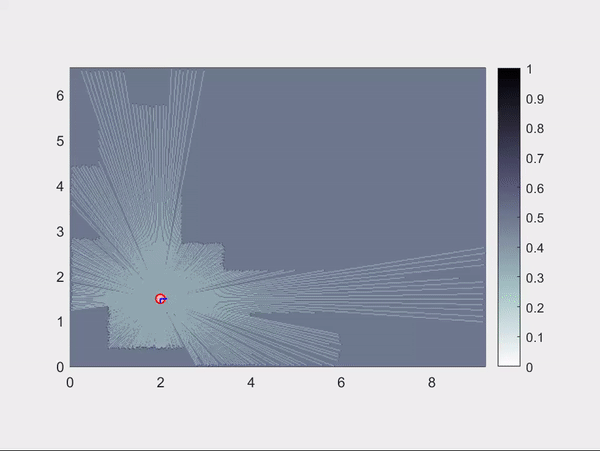

# Neato SLAM (University of Newcastle MCHA4000 Module, G6)

## Introduction
---

The goal of this project is to implement a Simultaneous Localisation and Mapping (SLAM) solution for the [NEATO Vacuum Cleaner Robot](https://www.neatorobotics.com/au/). The initial project goal was to implement the SLAM algorithm onto an on-board microcontroller
in the Neato Robot via an interface with MATLAB code. This project was changed to a full simulation based project as access to the Neato Robot hardware was hindered due to unforeseen circumstances caused by the global pandemic.

#### What is SLAM? 

To understand SLAM, we have to understand localisation and mapping respectively. Localisation is figuring where in the world is the robot given a map, mapping is figuring out the map of the surrouding environment of the robot as it moves around.
SLAM deals with the problem of constructing a map of an unknown environment while simultaneously figuring out the location of the robot. If we do not have a map, how would we figure out the location of the robot (Localisation)? On the other hand,
if we do not know where is the robot, how would we map the surrounding environment to begin with (Mapping)? This is why SLAM is commonly known as a chicken-and-egg problem.

In order to solve the SLAM problem, we can alternate between localisation and mapping in search for the best estimation of the pose of the robot and map as time progresses. This is usually done with the help of using probabilistic 
approaches such as bayes filters which is use to update the probability of the location of the robot (states) as more information are made known. 

The sensors used on the Neato Robot are encoders and Light Detection and Ranging (LIDAR). Encoders are used to calculate the number of rotation of the wheels while LIDAR sends out laser light and measure the reflection of the laser 
to compute the distance ranges. It is worth noting that sensors are corrupted with noise due to internal hardware limitation and the changes in the surrounding environment such as a bump on the road or fiction changes.
Therefore, probabilistic approaches are vital to ensure that information is consistently updated through time as a feedback mechanism as we can never fully trust sensor readings. Sensor noise is one of the main reason why SLAM is a
difficult problem. If we know the precise movement of the robot with exact LIDAR range measurements, then we do not need to set up any probabilistic approaches for localisation and mapping as everything is deterministic. Unfortunately,
sensors are never perfect. 

## Code Guide and explanation
----

The code guide section is divided into 4 main sections namely Data generation, Mapping with known poses, Localisation, SLAM. Each section will have explanation of the code involved and its location. Some technical details will be shared too.

All the main scripts to run data generation, localisation, mapping and slam are all `main*.m `files while the folders of functions contains the necessary auxiliaries scripts which path are added automatically in the `main*.m` scripts.

### Data Generation

Running `mainDataGeneration.m` will simulate a robot moving around given map. The lidar is assume to be in the centre of rotation of the robot. Raycasting allows us to compute lidar range measurements from a given map. It can be seen in the animation below that
there are added noise into the lidar rays which is very important to simulate real lidar sensors. Lidar measurement noise was added by using a gaussian distribution on rays that hits obstacles, chance for potential short readings and random ranges
was also added. Lidar simulation scripts can be found in folder `lidar_functions` which consist of `scanNE.c` for raycasting and `simulateNoisyLidarScan.m` for adding noise to lidar ranges.

The robot goes around with manual velocity inputs being fed into the kinematic model which can be found in `init_functions/robotDiscKinematics.m`. The map was done using the application Paint (free in-built Windows application) and converting
into binary values by `mapplot_functions/loadMapFromImage.m`. It is important that the image is converted to a binary matrix representation then we can represent value 1 as occupied and 0 as unoccupied for individual grid cells.
The code is set up in a way where we have the flexibility to easily add obstacles, change the structure of the map and everything else will still run the same.

The `init_functions` folder also consist of all of the necessary initialisation for lidar parameters (`getLidarParam.m`),map parameters (`getMapParam.m`), robot process model parameters (`getRobotParameters.m`) and occupancy grid (`initOccupancyGrid.m`).

The lidar ranges and states generated are stored as `.mat` files in the folder `data_generated` to be used by mapping,localising and SLAM algorithms.

### Mapping with known poses

Mapping with known poses is a problem where the robot has to map its surrounding environment assuming that we know the precise location of the robot at every time step. This is usually impossible due to sensor noise as previously mentioned.
However, the mapping algorithm used for SLAM are implemented exactly the same. Running `mainMapping.m` will move the robot around the map while mapping it. The mapping is using log-odds (good [reference](https://www.cs.cmu.edu/~16831-f14/notes/F14/16831_lecture06_agiri_dmcconac_kumarsha_nbhakta.pdf)),
implemented in `line 57 of mainMapping.m`. Auxiliary scripts for mapping can be found in the folder `mapping_functions`. 

Firstly, we need to compute the end points location of the lidar measurements which is done in `mapping_functions/inverseLidarModel.m`. Then, a line algorithm was used to trace the ray from the starting point (location of robot)
to the end points return by `inverseLidarModel.m`. Bresenham Line Algorithm `mapping_functions/bresenhamLineAlgo.m` was used.  `bresenhamLineAlgo.m` outputs a newly updated grid with probabilities of occupancy for individual cells that the
line passes through (unoccupied) and where it ends/hits (occupied), `line 5` allows you to change the probability of occupancy as u see fit. 

Note that max ranges of lidar are filtered out as it is unnecessary risk in the case of this application as the lidar may return max range even if there is an obstacle 
ahead of it due to sensor failure. `mapping_functions/plotInit.m` initialises the occupancy grid map while `mapping_functions/plotUpdate.m` updates the occupancy grid map in every iteration.

Result of mapping algorithm can be seen in the comparison below:

Actual Map                |  Map from algorithm   
:-------------------------:|:-------------------------:|
   |  

### Localisation

#### Particle Filter

Given the map, we need to figure out how to localise the robot (figure out where is the robot). We have no clue on the initial position of the robot in the map, it could be anywhere that is unoccupied with any
orientation. Therefore, to solve this problem commonly known as the global relocalisation/kidnapped vehicle problem, we can use a particle filter. In the picture below, shows the random initialisation
of particles distributed throughout the whole map using the function `localization_functions/globalParticles.m`. `globalParticles.m` uniformly distributes particles in unoccupied cells of any map given to it.

The lidar likelihood model is set up in `localization_functions/lidarModel.m`, this script compute the log weights of every particle proposed based on a lidar mixture distribution of hits,shorts,random,max likelihood.
The particles are then resampled using the weights computed using the function `localization_functions/resampleSystematic.m` and applying effective resampling using the function `localization_functions/getNeff.m` 
which was recommended by a [paper](http://ais.informatik.uni-freiburg.de/publications/papers/grisetti07tro.pdf) to maintain particle diversity.

Run `mainLocalization_PF.m` to observe particle filter algorithm being run, animation:

#### Unscented Kalman Filter (UKF)

Run `mainUKFLocalization.m` to observe using UKF for localization. The main functions used to implement UKF is in the unscented transform for the measurement update and prediction step (`UnscentedTransform.m` and `UnscentedTransformUpdate.m`).
`UnscentedTransformUpdate.m` uses `update.m` to update the lidar measurements by using the predicted pose (North,East,Yaw) to raycast (`scanNE.c`), the raycast readings are compared to the actual lidar measurements. Most of the time was spent tuning
the measurement covariances (parameter R) and process noise (Q) to get the UKF to work. The value of Q and R was adjusted till the robot manages to go around the whole map as expected. It can be observed that the trajectory is not perfect as
was simulated which is to be expected as there are noise.

### SLAM

We combine the UKF localisation and mapping algorithm implementation together to solve the SLAM problem by alternating between localising and mapping.

##### UKF SLAM

The UKF SLAM Algorithm requires a fair bit of tuning for the measurement (R) and process model (Q) covariances to ensure that the algorithm will work. The animation below shows
what happens when the algorithm is not finely tuned. Once the localisation is off tracks, the mapping will follow suit (vice versa). 

Therefore, it is imperative that we tune Q and R by observing the robot motion and mapping. The animation shows what happens after tuning. It can be seen that
it is still not perfect as the map is slighty off the ground truth map as it is very difficult to perfectly predict the robot poses at every time step while
constructing a new map. 

## Dependencies

As of 1st of July 2020, code successfully run on MATLAB R2019B with in-built standard libraries. Author is not aware of any extra library needed. The only program necessary to run the whole code base is MATLAB.

## Extra 1: Iterative Closest Point Algorithm

Run `mainICP.m` which is the script that validates that the `icp.m` function is working as expected, we use the ICP algorithm to propose states 
(North,East,Yaw Angle) using lidar point cloud. ICP can replace odometry data. However, ICP is also suspectible to noise.
The ICP algorithm is used as measurements for the proposed states for the localisation task in `mainUKFLocalization_ICP.m`. This method heavily dependent on the 
accuracy of proposal made by the ICP algorithm. If the ICP algorithm proposes a state that the slighty wrong each time step, it could cause a large drifting error in
the long run. [3rd Party ICP Code credits](https://www.mathworks.com/matlabcentral/fileexchange/12627-iterative-closest-point-method)

Example of ICP result, matching point clouds with new state proposal:

Before ICP                 |  After ICP   
:-------------------------:|:-------------------------:|
   |  

## Extra 2: FastSLAM 1.0

FastSLAM 1.0 is implemented in `mainFastSLAM.m`. FastSLAM 1.0 is a SLAM algorithm that uses Rao-blackwellized Particle Filter where each particle consist of
an individual map. The FastSLAM algorithm despite its name runs extremely slowly as it is computationally intensive, this made it very hard to tune as every iteration
takes very long. Besides that, my personal laptop cannot compute too many particles which lead a change of approach to use UKF SLAM instead.

